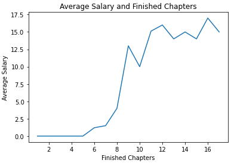
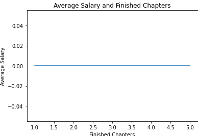
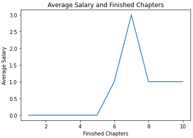

[DESIGN]总体框架
===
- [[DESIGN]总体框架](#design总体框架)
- [指引](#指引)
- [反思：精英创作的隐忧](#反思精英创作的隐忧)
- [复刻：把起点模式学到手](#复刻把起点模式学到手)
  - [按章付费](#按章付费)
  - [VIP机制](#vip机制)
  - [渠道商和分发者怎么办](#渠道商和分发者怎么办)
  - [总结](#总结)
- [创新：相同的路口，不同的选择(Working in Progress)](#创新相同的路口不同的选择working-in-progress)
  - [收入预期](#收入预期)
  - [经济学的合理性（Still Need A Lot Hardwork)](#经济学的合理性still-need-a-lot-hardwork)
    - [长内容的供需关系](#长内容的供需关系)

# 指引

在阅读本提案之前，可以粗粗浏览下[网文的历史](../misc/the-history-of-webnovel.md)，尽管本项目的长远目标在于构造一种去中心化的通用的的内容创作机制和平台，但网文是极具参考意义的例子，可以认为是一种社交创作的成功实践。

我们通过网文在中国的发展的三个阶段来展开我们的反思，借鉴和创新。因此本文的三个章节也分别对应着中国网文的阶段。

- 反思：精英创作的隐忧。我们关注到市面上一些准备进入文字内容创作的web3平台，尽管他们的创始人有着极高的哲学架构和对web3经济的理解，但可能对实际商业模式运转的了解会成为一把双刃剑。这意味着他们可能一方面可以天马行空的创造前所未有的巨大可能性，但另一方面也会因为这种空中楼阁而让真实用户无法接近。这一章对应着历史的*1995-2002：艰难的探索，草船借箭欠东风风*。
- 复刻：把盛大模式学到手，不可否认的是，起点等一帮网文商业化的探索者，提出的一系列围绕付费展开的商业模型奠定了网文发展的基础。实际上欧美网文行业在2015年左右还坚持着“靠爱发电”和“畅销书”两种极端的商业模型。我们需要基本的工具和算法来实现在去中心化下对上述逻辑的再实现。但因为他是去中心化的实现，他应当具有更好的成本结构和更公平的分配机制，尤其是如何解决的创意本身的随机性冲突。这一张对应着历史的*2003-2012：付费时代开始，盛大资本入局*。
- 创新：相同的路口，不同的选择。我们认为去中心化的商业模型复现可以帮我们积累到相当体量的用户群体。但随之而来，也会面临今天长平台领域共同的问题，如何更好的更高效的放大用户价值和实现粉丝经济。相比较 Netflix 和腾讯这样的巨头以垄断的方式来博弈，我们希望选择用公平的规则和数学来共赢。

我们认为项目的根本价值和原则在于:

1. 提供给了创作者以更大的利益和权力，让作者不用低价被迫放弃自己版权的同时，可以获得来自用户阅读的收入。
2. 允许一定程度理解内容和愿意承担风险的社会资源和资本平摊长内容领域的成本风险，并公平获取利润。实际上一本小说的收益可以被更公平的决定。
3. 渠道商，分发商，网文平台可以不再承担**“垄断”**的风险投资者角色， 可以以更专注的进行选品和推广操作。

我们依赖于下列事实实现上述价值：

1. 去中心化技术带来的 code is law 和 低信任成本
2. 以作者为中心的平台将吸引好的作者和作品，从而建立好的内容社交生态，好作者是内容质量的保证，而内容质量是内容经济的核心

我们仍然面临的挑战：

1. 我们虽然期望内容创作的早期投资者（也可能类似选品编辑）和后续推广运营（比如渠道商，分发商）之间的分立博弈来实现利益总体的公平和正向发展，但是仍然可能存在渠道反客为主的问题。从而使得整体框架退化。
2. 由于编辑，运营这一角色在设计中的缺乏，可能如何更好的反馈和培育作者的机制存在匮乏。
3. 好的机制不一定带来成功，以怎么样的方式吸引更多好的人参与运营并推广这一理想。

# 反思：精英创作的隐忧

当Mirror在2021年初推出时，该平台仅限邀请的用户使用，新成员通过$WRITE竞赛‌（这是一个社区投票系统）获得Mirror的使用资格，从而稳定地加入新的作家。然而，在2021年10月，Mirror团队开放了该平台供任何拥有以太坊地址的人使用‌。Mirror想做一个授权给Web3创意人的“自己动手（DIY）“的出版套件。其实这很像在1995-2002年在网文领域所发生的事情： 个人书站以及以BBS为依托的小众精英化是初期的主流，包括当时一些类似网易这样的平台所提供的使用方式。另一方面，尽管和那时的靠爱发电不同， Mirror 很早的就设计了例如NFT，众筹这样的让创作和收入挂钩的机制，但整体产品缺乏明确的主线和配合度，实际上，只有有一定知名度和运营能力的精英才可以从这种机制上脱颖而出。而在中国的网文的世界或者现实的世界，其实很多人愿意为了千字10元而进行创作。

在某种程度上，这些网文作者的变现也主要依靠一次成功的出版，就类似Mirror的NFT变现一样, 但却有可能随着特定的NFT市场的热度下降而失去价值：

> 2001年7月“龙的天空”成立关联出版机构，为网络文学作品提供线下出版变现的途径。然而，在这个关键时刻，将资源集中于线下出版，被时代证明是错误的选择。由于线上投入太少，“龙的天空”网站逐渐衰落下去。

我们可以给出一些观点,有一些可能是反传统的去中心化项目传统的设计逻辑的，但他可能更有价值：

- 按章节的写作反馈意见其实是框架上更重要的工具，只有少数精英才可以在一个长内容的逻辑里勾画自如。而且相比较mirror等在做的，提供一个技术上看起来很酷的工具，更重要的在于用技术建立读者对作者更实时的反馈。按章付费是一个很棒的主意。
- 对普通人更友好，相比较一次价值十万美金的众筹和造富活动和能够在媒体上引起的Highlight，细水长流的涉及到成千上万个作者的每天10$的收入可能是更好的保障。

# 复刻：把起点模式学到手

在网文的早期阶段过去，引入了按章付费和VIP付费，并且率先确立了稿酬制度。我们设计了如下的机制。

## 按章付费

**TL;DR**：和开放内容，通过打赏获利不同，我们设计了一个零知识报童机制可以模仿掉现有的中心化分发解锁机制，即用户必须付费，才能解锁内容。这意味着区块链上没有任何内容的明文，但智能合约能完成内容的解锁交易，让付费解锁的用户可以阅读。 

我们先解决最基本的问题，也就是如何在没有一个中心化的第三方的情况下，实现按章节付费。这里的难点主要在于，你不能把内容放在链上，这样大家都可以免费阅读。但如果你把内容放在例如零六ipfs这样的地方，并私下给购买者，那合约又该如何确保作者确实把内容给到了读者。

我们引入一种保险箱机制，作者可以将写完的该章节存入该保险箱，该保险箱功能如下：

> 保险箱拥有该不章节，但并不能获得该章节的明文，但是它可以根据区块链上某个合约的交易结果将他所拥有的密文转化为仅该交易的某个参与者可以解密的编码发布出来。

我们称这样的保险箱为”零知识报童“。我们在[CR-2](CR-2.zh.md)会详细介绍该机制。我们简要的概述如下：

> 半链报童：
> 1. 作者在本地将内容$A$用密钥矩阵P$$进行加密得到 $B = PA$，并将$P$，$B$发布到链上newsboy合约，作者拥有密钥逆矩阵$P'$
> 2. 读者首先生成一次性密钥矩阵$U$和$U'$, 当读者支付完成后，向newsboy合约提交 $C_1= U\times P$,并私信$U$给到作者。作者计算出$C_2 = P'\times U'$。到这步为止，资金虽然提交到了合约里，但是作者没有提出该资金的权力。
> 3. 作者向newsboy提交$C_2$，合约验证  $C_1 
> \times C_2 = I$后释放资金。用户可通过$C_2$计算出$P'=C_2 \times U$ 从而可以解锁明文$A=P' \times B = P' \times P \times A$ 。
> 
> 备注1： 链上公开的仅有$B$, $C_1$, $C_2$和$P$四个矩阵，因此用户没法通过公开信息获得$P'$从而解锁明文$A$。此外我们并不考虑$P'$的恶意泄露问题，因为用户已经可以看到明文, 实际上这属于盗版问题。我们面临的另一个问题是：用户是否可以公开解密$P'$而免除盗版的追责，在这个问题上，一方面，我们期望通过和司法人士的合作来完成， 一个有着明确目的的私钥确实侵犯了权力。另一方面，我们可以增加违法的成本，例如将 $C_2$ 乘以用户的公钥，这样用户在网上披露解锁密钥时，就必须披露自己的私钥。而披露自己的钱包私钥是一个代价很高的行为。
> 
> 备注2：用矩阵是为了简化理解。实际上这是一个零知识证明过程。
> 
> 备注3：我们也在考虑门限密钥机制来实现，从而在引入若干个服务节点（可能会有略微的中心化倾向）的同时提高服务速度和降低作者的解锁服务器的成本。
> 
> 备注4：此机制可以用来提供SDK，以监督可能的下游供应商的流量。

我们可以通过报童来轻松实现一个按章节付费的智能合约，在[CR-3](CR-3.zh.md)里，我们将提供一系列开放的订阅制合约协议的具体标准:

```solidity
import “./NewsBoy.sol”;

contract subscriber {

function subscribeChapter(uint chapterNum) payable{
  uint chapterPrice = chaptersPrice[chapterNum];
  require (msg.value >= chapterPrice);
  account.transfer(msg.value);
  uint moneyToReturn = msg.value - chapterPrice;
  newsboy.unlockContent(msg.sender, chapterNum, chapterPrice); 
  boughtSomething = true;
  if(moneyToReturn > 0)
    msg.sender.transfer(moneyToReturn);
  }

 function withdraw(uint amount) onlyOwner

 function emitUnlockKey(uint[] unlockKey) onlyOwner
}
```

> 备注：newsboy.unlockContent 有点类似异步的future，函数不会立即获得结果，用户需要等作者披露密钥，而作者也不能立即拉到资金，当这步完成时，实际上资金被存储在合约的受限区（可通过withdraw的函数来限制），仅当作者emitUnlockKey提交了正确的密钥，该笔资金被释放。

在这个简单的解法里，我们通过报童基本上实现了网文平台早期最基础的功能。进一步：
- 点赞
- 打赏
- 排行榜
  
都是手到擒来的功能。

## VIP机制

TL:DR: 随着最基础的问题被解决，我们居然可以在区块链上实现一个substack，Kindle Ultimate或者无限月读卡的功能。更令人激动的是，我们提供了一个开放性且扩展性极强的框架，允许任何人运营一个属于自己的Kindle Ultimate。

一个实现会员机制最直接的做法:

```solidity
function subscribeChapterForMembership(uint chapterNum) payable{
  uint chapterPrice = chaptersPrice[chapterNum];
  require (isMembership[msg.sender]); // 验证用户属于会员
  newsboy.unlockContent(msg.sender, chapterNum, chapterPrice); 
```

我们进一步探究运营场景，为了给作者提供一个稳定的收入，这个是我们第一章所坚持的观点，一个稳定的增长趋势的收入更有利于作者形成有价值的创作，在这里我们再次重申。允许一些例如会员无限读计划的实现，从历年来游戏行业（如Xbox Game Pass)和网文行业的实践来看，会员机制有助于获取巨大且稳定的核心用户和收入。我们提供了一个标准，允许在合理的按周期支付的价格下，将一本书添加进入一个会员计划。

```solidity
function AddToProgram(uint256 size) onlyProgram // 允许某个会员计划将这本书添加进入该计划
```
> onlyProgram是一个限制，在早期可能有一些限制要求例如储备金来确保合格的会员计划才能成立。

一个会员计划同样一个合约协议，创建者，可能是一个人也可能是一家公司或者一个DAO，实现了该协议所需要的必须接口：

```solidity
function join(uint period) payable //加入计划 
function leave() // 离开计划
function addOneBookToProgram(address abook) //加入一本书到计划
```

当一本书加入项目后，该项目需要以稳定的按周或者月的形式，价格决定机制由如下几种， 且根据字数和人数的不同，单价也不同，但一般来说，这是一个批发机制，当你的量越大的时候，单价越便宜：
  - 总阅读字数 * 字数价格
  - 总阅读人数 * 包月费用

支付方式由预付+尾款组成，预付应为加入计划所承诺的size的30-50%。

由于会员计划的资金往往是较为固定的月度制，此项制度可以提高作家的收入稳定性。另一方面，由于会员计划是开放的，它可以吸引一部分人参与进来。关于会员计划的协议可以在[CR-4](CR-4.zh.md)获得更详细的了解。


> 备注：funstory也企图用中心化的力量推进过类似的书单书城分销计划，但似乎没有获得好的结果。虽然对于一个中心化的分销设计，目前的开放式的计划更有助于获得更多好的书，以及，更具想象力的，在会员计划合约上推动金融创新，但我们仍然需要探索更好的机制和运营力量去推进具有分销特点的会员计划，

## 渠道商和分发者怎么办

首先，出于兼容性考虑，那些允许作者保留版权的平台仍然可以和作者私下谈判，将他们的小说发布在平台上，同时他们的小说也可以在链上得以访问。

> 在这种情况，目前已经实现的网文平台有什么优势呢？如果我们不考虑在下一章所引入的关系到投资激励和长期收入承诺的优势，至少我们可以提高你的议价权：当你有一些基准的数据，你可以估算你的收入范围，因为合约和数据是公开的，你从而可以获得一个合理的买断报价。另一方面，如果某平台定价太高，而给你太少的时候，你可以利用此平台进行对冲。 

为了降低谈判，交易成本，我们提供了开放分销协议[CR-5](CR-5.zh.md)
```solidity
function subscribeChapterFromVendor(uint chapterNum, uint vendorId, bytes vendorTx,
bytes vendorSign)
```
一个分销商的用户会通过在自己的应用访问该接口，来实现解锁。该接口可以提供分成功能。对于大部分渠道商和发布者：他们可以以几乎为0的信任成本去将书籍在自己的平台上上架。

对于企图获取独家传播权或者更大的买断权力的平台（通常他们需要买断以进行营销和大规模投放，如果采用分成制度，他们将面临成本结构上的问题），我们如何更合理的解决利益分配问题，将在第三部分提出一些机制阐述和解决。

## 总结

截止到目前为止，我们已经了对付费订阅的商业的去中心化复制，可以基于现有的区块链设施，在用户和作者之间提供一个安全，实用的网文平台。对比传统的“中心化的”网文平台，他由如下优点：
- 以协议实现，任何参与者可以根据相关规范和协议，提供一个具体的服务，比如作者平台，书目聚合器，好书发现，渠道商或者其他应有的角色，这得益于区块链数据的开放性和低信用成本。这对比传统的产业链条所具有交易信任成本是有价值的
- 解决了原有网文生意存在的扣量问题，即渠道商和平台成为事实的利润分配者，作者一般占据比较弱势的地位。
- 
但我们也必须指出仍有不足之处：
- 因为利润的分配权可能会朝作者倾斜，而是否此项会带来整体的发展，需要进一步思考和验证。正如古典经济学所争论的：提高名义工资水平是否带来整体需求上升一样。
- 尽管信用成本降低和数据开放性提高，但是区块链本身的交易成本不容忽视，在现行架构下，一笔交易需要的手续费往往需要0.15美元以上，高于解锁一篇文章的收入。我们期望的交易成本在0.005美元左右，当然，这可能通过交易聚合或者更加先进的Rollup机制来解决。
- 如何合理的激励作者，正如我们之前所提到的，长期性的激励作者是一件更重要的事情。

# 创新：相同的路口，不同的选择(Working in Progress)

> 本章节内容仍然处于高度的讨论和工作中，欢迎开放性的讨论。

在撰写本文的时候，以太坊创始人Vitalik Buterin发表了他的文章 [Decentralized Society: Finding Web3’s Soul](https://papers.ssrn.com/sol3/papers.cfm?abstract_id=4105763). "Pluralism" 和 "Public Good" 是我们也认为的重点。我们确实在很多所谓的去中心化项目上，或多或少的感受到我们倾向于复制一个 Private Goods的商业，而并非协作式的生一个为 Public Goods 的商业。这正是我们想改变的。我们虽然起点是网文，但我们认为可以推广到一般性的长内容市场。

我们认为，**长内容的内容社区应该形成一个稳定且增长的多元化的公共事业**。内容行业具有分散化，即很难找到真正的绝对巨头（比如奈飞虽然一度占领了市场认知，但HBO，Disney等进入流媒体行业后，格局发生变化）。另一方面，长内容也需要一个公共性的平台，以避免类似 Twitter，Wechat的悲剧，发生在短内容上所出现的极端观点也容易出现在长内容上，而且考虑长内容影响的深远性，这种由私有公司运营的长内容平台，受到压力而做出内容审查的可能性更大。

## 收入预期

从目前的实践中，在一个如果完全依托解锁订阅的创作活动中, 随着章节的数量增多，作者的平均收入（尽管收入往往是和字数成正比的，但作者一段时间的产出具有固定性）如下图:



注意到创作者在开始阶段收入往往是0，因为实际上只有完成了一些章节, 产生了足够的故事性和吸引力，用户才会开始愿意付费。随着已完成章节数的增多，平均收入会显著提高，因为在这个阶段，用户赶上最新章节的付费需求量增加趋势较快，因为大家是新付费用户。此后，会进一步老用户比例加多，而他们仅仅需要对新章节付费，总体收入达到一个平衡阶段。

注意到，尽管收入的趋势是上升的，但是会存在随机的起伏，而我们的会员计划则会熨平这部分收入起伏，使得收入的曲线更加平滑。

当然，并不是所有的作者都能看到自己的平均收入上升，对有一些作者来说，他的曲线可能如下图：

- 作者在收入为零的阶段放弃了写作, 那么他的收入可能长期看是0



- 作者在收入增长不及预期，放弃写作或者摆烂



我们引入章节转化率作为一个关键的后验观察指标来解释某种内容的内生吸引力

$$P_{next} = \{ readNextChapter | readCurrentChapter\}$$

> 备注，在我们的实践中，这一指标在大受众的情况下有效性更好, 在小样本情况下如何提供一个更好的指标值得讨论。

分析上述情况，我们认为建立合理的薪资保障制度是避免去中心化平台的重要因素，因为现有的网文公司在编辑同作者签约后，会支付一份按字数的稿费，即某种程度上稳定了作者的一个长期薪资预期的稳定性。作者期待的长期薪资预期：

- 在开始阶段，作者会期待一个相对较低却有一定的薪资预期，即可能在用户愿意接受的付费章节开始之前和风险极高的放弃章节之后，提供一个例如“低保”的支付机构
- 随着收入的快速增长，可能会超出作者的短期薪资需求，同时也避免随机性对作者产生的挫折感，从而使得作者盲目追求 $P_{next}$即短期利益而影响整体的小说节奏展开,可以适当将超预期的收益部分作为准备金而储蓄起来。

简而言之，我们意图构造一条符合作者理性收益预期和实现整体利益最大化的收益分配曲线，从而更好地激励作者合理创作，它应当具有如下功能：

- 低保承诺: 适当引入社区的风险资金，帮助作者度过早期的艰难创作阶段。
- 稳定预期：当进入一个付费阶段后，能熨平中短期的收入波动。
- 合理反哺：当进入了后期的盈利阶段，其超出作者平均劳动工资的合理部分可以用来反馈给社区风险资金。
  
从而在创作的中早期阶段，给与一个“薪资保障”，如果我们认为对于成功的小说，作者后期的薪资预期低于实际的收入，那么这一个商业模式是合理的。

> 共谋的破坏: 渠道仍然可能和社区风险资金的部分合作从而进行把持，在某种程度上说，如果渠道仍然能把持来自用户侧收益的分配，那么可能存在一些攻击使得收益分配不合理。

> 反对者可能会对低保制度进行探讨，他们的理由可能是，我们如果就总体来看，低保制度无论其是否社区的风险资金，本质上仍然是从长内容行业总体的收益中分出一部分，用以补贴低收入人群，这可能是对市场化的违背。以刚性工资来举例，Pigou 曾认为刚性工资影响了充分就业，并提出以缩减工资来实现充分就业的方式。我们回击这一观点的强烈信念来源于，”投资“会刺激长内容的生产和需求，从而增加整体的收入。我们将在经济学的合理性部分表达我们的观点和理由。
> 
> 另一些反对者可能会这种分配机制所可能阐述的复杂性担忧，他们认为大部分作者更向和一个传统的编辑沟通，并获得一份字数稿费合同。我们承认就本文来说，暂时没有对这个问题提供很好的解决，但我们相信我们能提供比传统方式更好的收入预期与利益分配，也会尽力工作提高最终产品的易用性。


我们的解决框架如下：

1. 我们提供一个薪资池，作者可以将自己的权益注入进去，如：
- 带有参数的收益分配权
- IP衍生开发价值
- NFT或其他

2. 实际上，该薪资池可以认为是一个雇佣作者劳动以产生作品的实际公司。薪资池一个类似 AMM 的机制。他负责小说的权益代币和某种具有支付功能的代币，比如稳定比的对价功能。

3. 薪资池根据章节数发放给作者权益代币$T_{author}=Supply(c)$, Supply函数具有如下性质:
   1. $$\int_{0}^{chapter\ num\ upper} Supply(x) dx = C$$
   2. $$ \forall x \in \left[0, chapter\ num\ limit\right]  Supply(x)>=0$$

4. 同时AMM机制拥有自己的曲线，用来即 $Token\ Price = Curve(X, Y)$
5. 作者实际上能获得的收益由$Supply(c) * Curve(X, Y)$, 即作者实际上通过增加章节获得的新代币，去该AMM上进行兑换。

在这种框架下，$Supply$函数用来控制收入曲线，而该薪资池是对作品质量的反馈。另一方面，作者作品的一定比例收入会买入薪资池，从而在后期实现收益的分配。这种机制后续也会带来例如拍卖某种特定权力, 如独家销售权的便利。


## 经济学的合理性（Still Need A Lot Hardwork)

这并非是一个讨论代币经济学的假设，我们反思，在这些具体的机制下，一个去中心化的长内容平台是否具有更好的经济价值，这里的经济价值并非指其内部分配更合理，亦或者其带来了投机者或者更多的货币，可能是例如是否更好的提高了长内容的供应以及这些供应和社区的运营努力提高了对长内容的需求。

### 长内容的供需关系
基本假设：
- 长内容存在马太效应
- 读者（需求方）平均价格在供给数量上边际效应递减。

直观的增加整体PQ面积的方式在于将需求曲线往右上方移动。